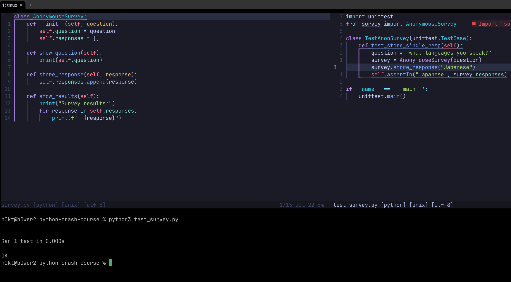

# Python Crash Course Notes

# Content
- [Python Crash Course Notes](#python-crash-course-notes)
- [Content](#content)
    - [Basics](#basics)
        - [Variable types](#variable-types)
        - [Some more tips](#some-more-tips)
        - [Control flow structures](#control-flow-structures)
        - [Functions and arguments](#functions-and-arguments)
        - [Classes and objects](#classes-and-objects)
        - [Files and Exceptions](#files-and-exceptions)
    - [Project: Alien Invasion](#project-alien-invasion)
    - [Project: Data visualization](#project-data-visualization)
    - [Project: Web applications](#project-web-applications)

## Basics
### Variable types
- Strings `str`
- Integers `int`
    - Long numbers can be written with underscores `_` for readability. `14_000_000_000`
- Floats `float`
    - Dividing ints will result in a float number
- Lists `list`
    - Collection of items (ints, strs, floats, lists, etc)
    - `.pop()`, `del x[x]`, `.remove()` remove items from a list, pop returns the value
- Tuples: `tuple`
    - Immutable list of items (strings, ints, floats, tuples, lists, etc)
- Dictionaries `dict`
    - Collection of key-value pairs items (strs, ints, floats, lists, tuples, dicts, etc)

### Some more tips
- Looking for documentation? No worries you can always run `python -m pydoc -b` and it will load your current environment packages and all its documentation in http://localhost:58261
- If you want to know more about a particular object you can always check it with help() or dir() functions. For example `help(list)` or `dir(list)`.
    - You can also read a brief description of whatever you have in `ipython` typing `?` or `??` after any variable or function. For example `list?` or `list??`.
- You can also check what are the current built-ins available for you with: `help(__builtins__)` or `dir(__builtins__)`.
    - Common builtin functions: `input`, `range`, `type`, `random` module, `open`, 

### Control flow structures
Those are: `if`, `elif`, `else`, `for`, `while`, `break`, `continue`, `pass`, `with`.
    - To break the `while` loop, you can use a **flag variable** or the `break` statement.

### Functions and arguments

### Classes and objects
- `__init__()` special method that runs on each obj instantiation
- `self` parameter is a reference of the instance itself, always goes first in the method definition
- Inheritance: `class ChildClass(ParentClass):...`
    - The init function has to invoke the parent's class init function: `super().__init__(foo, bar, baz)`
    - A class parameter can also be another object which has parameters and functions

### Files and Exceptions
- We can write to files, also read, append, etc. :duck:

**Exceptions**
- TODO: What kind of Exceptions we should care?: FilenoError, FileNotFoundError, ZeroDivisionError, etc
- `try`, `except`, `else`, `finally` blocks
    - You can check all available exceptions by: `import builtins` then `[exc for exc in dir(builtins) if 'Error' in exc or 'Exception' in exc]`
    - Then check the exception class: `help(FileNotFoundError)`

### Testing your code
- Usage of `unittest` module

## Project: Alien Invasion

## Project: Data visualization
## Project: Web applications
